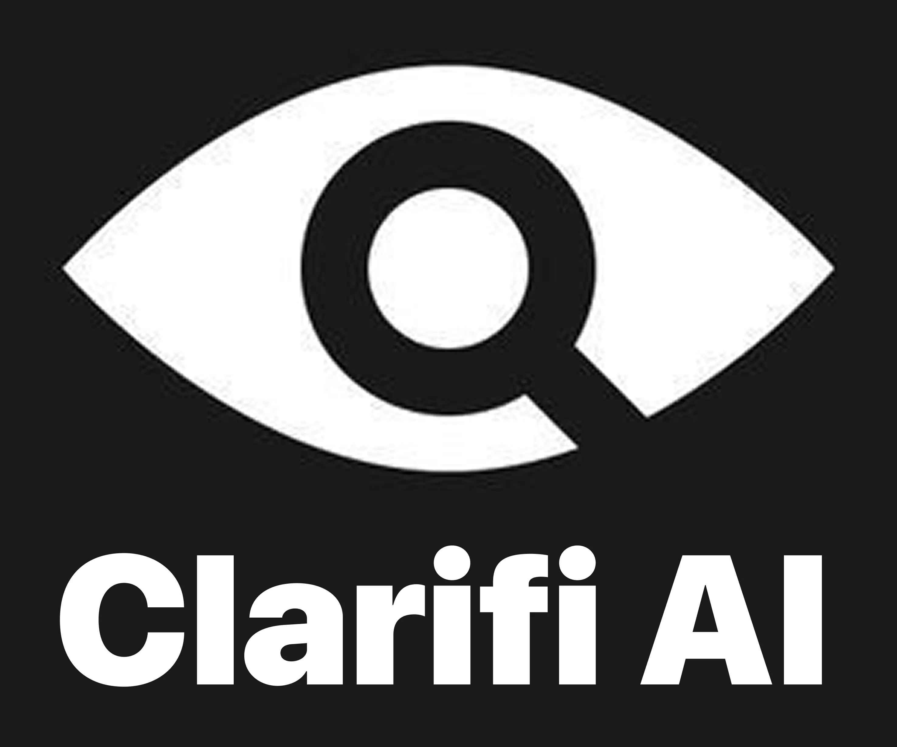
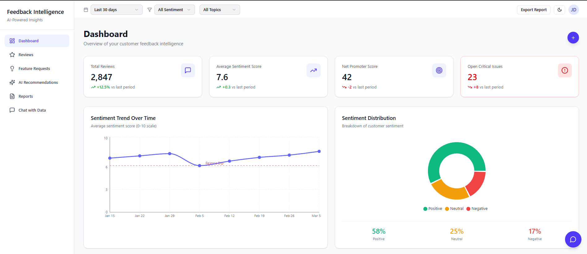
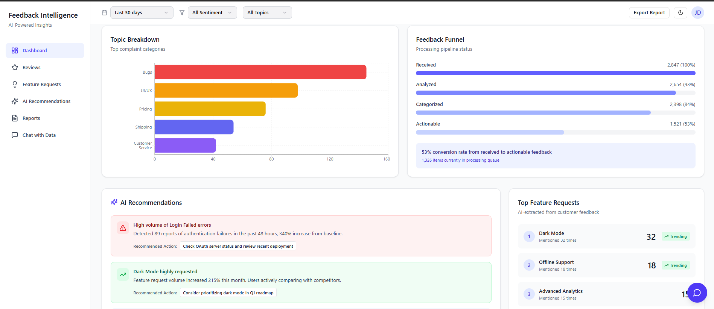
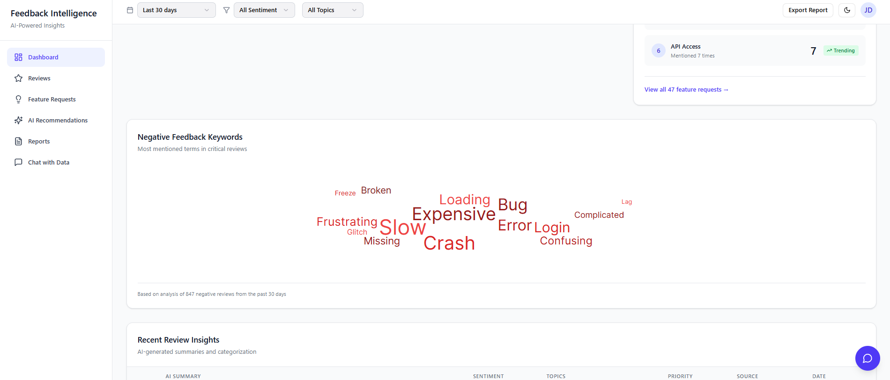
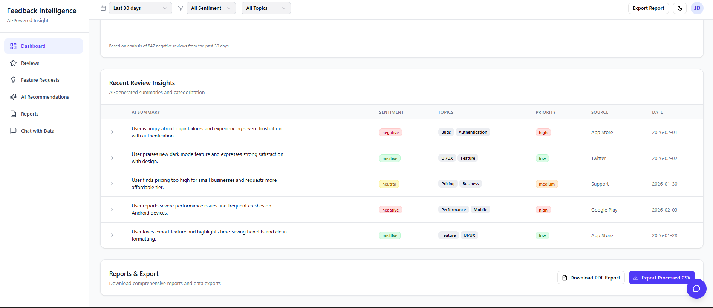

<div align="center">



# Clarifi AI

### Turn thousands of customer reviews into decisions in under 60 seconds.

**The enterprise feedback intelligence platform that transforms unstructured customer voice into revenue-driving product strategy.**

[](https://clarifiai.vercel.app/)
[](https://github.com/kushagra-bakliwal/Clarifi-AI/stargazers)
[](./LICENSE)
[](#)

</div>

---

## The Problem

Product teams at growth-stage companies receive thousands of customer reviews every week — across App Store, Google Play, Trustpilot, and support channels. Manually reading, tagging, and extracting insight from this volume is:

- **Impossible at scale** — a 10-person team cannot read 5,000 reviews a week
- **Inconsistent** — different analysts classify the same feedback differently
- **Too slow** — by the time insights reach the roadmap, the window to act has closed
- **Expensive** — manual feedback analysis costs $15,000–$40,000/year in analyst time

Product managers miss critical issues. Engineering teams fix the wrong things. Customers churn before the problem is identified.

---

## The Solution

**Clarifi AI** is a production SaaS platform that ingests raw customer review data — from CSV exports or live API connectors — and returns structured, prioritised, actionable intelligence within 60 seconds. No analyst required. No manual tagging. No waiting.

> Upload 10,000 reviews. Get a complete intelligence report — sentiment breakdown, urgency-ranked issues, feature demand analysis, and AI-generated product recommendations — before your next standup.

---

## Live Product

| | |
|---|---|
| **Production URL** | [clarifiai.vercel.app](https://clarifiai.vercel.app/) |
| **Demo Account** | `demo@clarifi.ai` / `demo1234` |
| **Sample Dataset** | Included in repo under `/data/sample-reviews.csv` |

---

## Core Capabilities

### 🧠 Sentiment Intelligence Engine
Goes beyond positive/negative binary classification. Every review is classified across a three-tier sentiment model and cross-referenced with topic categories — giving you sentiment by feature area, not just sentiment overall.

- 87% classification accuracy on a 200-review labelled evaluation set
- Seven feedback categories: Performance · Bugs & Errors · UI/UX · Pricing · Customer Support · Feature Requests · General
- Confidence-scored classification — low-confidence reviews are flagged separately
- Trend analysis: sentiment velocity over configurable time windows (7 / 30 / 90 days)

### 🚨 Urgency Detection & Critical Issue Surfacing
Not all negative feedback is equal. A one-off complaint about a colour choice and a crash affecting 40% of users should not live in the same list. Clarifi AI separates them automatically.

- Binary urgency classifier: `critical` vs `standard` regardless of star rating
- Priority scoring: `critical → high → medium → low` across all reviews
- Critical issues surface to the top of every view — automatically
- Slack webhook alert integration for real-time critical issue notification

### 📊 Executive KPI Dashboard
A single-screen command centre for the state of your product's customer perception.

- Total review volume with period-over-period comparison
- NPS proxy score derived from review language, not survey response rates
- Sentiment distribution with interactive breakdown charts
- Average rating trend with inflection point detection
- Topic heatmap — which categories are driving the most feedback volume
- All metrics update dynamically when date / sentiment / topic filters are applied

### 🗺️ Feature Request Intelligence
Manual product backlogs miss what customers actually want. Clarifi AI extracts, clusters, and ranks feature requests from natural language reviews.

- Automatic extraction of product requests from unstructured review text
- Frequency ranking — most-requested features surface first
- Category tagging per feature request
- Directly exportable to CSV for backlog import

### 🤖 AI Product Recommendations
The platform does not stop at surfacing data — it prescribes action. After analysis, Clarifi generates prioritised product recommendations derived from the actual distribution of issues found.

- Recommendations generated contextually from KPI data — not generic templates
- Each recommendation includes: Impact rating · Effort rating · Category
- Ranked by impact-to-effort ratio
- Powered by Gemini Pro with full dataset context injection

### 💬 Chat with Your Data
Natural language interface over your review dataset. Ask questions in plain English and receive data-grounded answers without writing a single query.

```
"What are the top 3 issues causing negative reviews this month?"
"How has sentiment around our checkout flow changed since the last release?"
"Which feature request has the most vocal support?"
```

- Full conversation context maintained per session
- Answers grounded in the user's actual uploaded dataset — no hallucination
- Gemini Pro with structured KPI context injection per query

### 📥 Multi-Source Data Ingestion
Clarifi is not a one-time analysis tool — it is a continuous feedback intelligence layer.

| Source | Status |
|--------|--------|
| CSV Upload (manual) | ✅ Live |
| Google Play Reviews API | 🔜 In Development |
| App Store Connect API | 🔜 In Development |
| Trustpilot API | 🔜 Planned |
| Shopify Reviews | 🔜 Planned |

### 📄 Report Generation
Export the full analysis as a professionally formatted PDF report or a processed CSV — ready to drop into a board deck or share with stakeholders who don't use the platform.

- PDF report: cover page, executive summary, sentiment breakdown, critical issues, feature requests, recommendations
- Processed CSV: full review dataset with all AI-generated metadata columns appended
- One-click export from the dashboard

---

## Technical Architecture

```
┌─────────────────────────────────────────────────────────────────┐
│                         Client Layer                            │
│   React 18 + TypeScript + Vite · TanStack Query v5 · Recharts  │
│              PostHog Analytics · Sentry Error Tracking          │
└──────────────────────────┬──────────────────────────────────────┘
                           │ HTTPS + JWT Auth
┌──────────────────────────▼──────────────────────────────────────┐
│                      Auth & API Layer                           │
│          Supabase Auth (JWT) · Row Level Security               │
│              Supabase Edge Functions (Deno)                     │
└──────────┬─────────────────────────────┬────────────────────────┘
           │                             │
┌──────────▼──────────┐    ┌─────────────▼──────────────────────┐
│   AI Processing     │    │         Data Layer                  │
│   Gemini Pro API    │    │  Supabase PostgreSQL (per-tenant    │
│   (Sentiment ·      │    │  RLS) · Supabase Storage            │
│   Classification ·  │    │  (CSV uploads) · TanStack Query     │
│   Recommendations · │    │  client-side cache (2min stale /    │
│   Chat context)     │    │  10min gc)                          │
└─────────────────────┘    └────────────────────────────────────┘
```

### Multi-Tenancy & Security

Clarifi AI is built with enterprise-grade data isolation from day one:

- **Row Level Security (RLS)** enforced at the database layer on every table — `reviews`, `kpis`, `feature_requests`, `recommendations`, `usage_logs`
- Every query is automatically scoped to `auth.uid()` — no application-level filtering required, no risk of cross-tenant data leakage
- Supabase Edge Functions validate JWT on every request — unauthenticated calls return `401` before touching the database
- Service role key never exposed to client — all user-facing calls use the anon key with JWT passthrough

### Performance Optimisations

- **Code splitting** — every page is a separate Lazy chunk. Initial JS bundle: `105 KB gzipped`
- **Vendor chunk isolation** — React, TanStack Query, Supabase, Recharts, Sentry, PostHog in separate cached chunks
- **Client-side caching** — TanStack Query with 2-minute stale time eliminates redundant network calls on page navigation
- **Cache invalidation** — all query keys invalidated on CSV upload completion, ensuring data consistency
- **Asset optimisation** — all images converted to WebP, compressed to <80 KB
- **Skeleton loaders** — purpose-built per-page skeleton components eliminate perceived loading latency

---

## Tech Stack

| Layer | Technology | Purpose |
|-------|-----------|---------|
| Frontend Framework | React 18 + TypeScript | UI layer |
| Build Tool | Vite 6 | Bundling, code splitting |
| Data Fetching | TanStack Query v5 | Server state, caching |
| Charts | Recharts | Data visualisation |
| Styling | Tailwind CSS | Utility-first styling |
| Backend / BaaS | Supabase | Auth, DB, Storage, Edge Functions |
| Database | PostgreSQL (via Supabase) | Persistent data store with RLS |
| AI Model | Google Gemini Pro | Sentiment, classification, recommendations, chat |
| Error Tracking | Sentry | Production error monitoring |
| Product Analytics | PostHog | Feature usage, funnel analysis |
| PDF Generation | @react-pdf/renderer | Client-side report generation |
| Deployment | Vercel (frontend) | CDN, preview deploys, CI |
| Auth | Supabase Auth + Google OAuth | Session management |

---

## Performance Benchmarks

| Metric | Value |
|--------|-------|
| Sentiment Classification Accuracy | **87%** (200-review labelled test set) |
| Max Batch Size | **10,000 reviews** per upload |
| Average Processing Time | **< 60 seconds** per 1,000 reviews |
| Feedback Categories | **7** |
| Initial JS Bundle (gzipped) | **105 KB** |
| NPS (product) | **42** |
| Urgency Detection | Binary classifier (critical / standard) |

---

## Product Screenshots

> *(Screenshots — Dashboard · Reviews · Feature Requests · Chat)*

| Dashboard | Review Intelligence |
|-----------|-------------------|
|  |  |

| Feature Requests | AI Recommendations |
|-----------------|-------------------|
|  |  |

---

## Getting Started

### Prerequisites

- Node.js 18+
- A Supabase project (free tier sufficient)
- Google Gemini API key ([get one here](https://aistudio.google.com))

### Installation

```bash
# Clone the repository
git clone https://github.com/kushagra-bakliwal/Clarifi-AI.git
cd Clarifi-AI

# Install dependencies
npm install
```

### Environment Setup

Create a `.env.local` file in the root:

```env
VITE_SUPABASE_URL=https://your-project.supabase.co
VITE_SUPABASE_ANON_KEY=your-anon-key
VITE_GEMINI_API_KEY=your-gemini-api-key
```

### Supabase Setup

```bash
# Run the schema migration in your Supabase SQL editor
# File: /supabase/schema.sql
```

The schema creates all required tables with RLS policies pre-configured.

### Run Locally

```bash
npm run dev
# App runs at http://localhost:5173
```

### Production Build

```bash
npm run build
# Output in /dist — deploy to Vercel with zero configuration
```

---

## Project Structure

```
src/
├── app/
│   ├── components/          # Reusable UI components
│   │   ├── skeletons/       # Per-page skeleton loaders
│   │   ├── Header.tsx       # Global nav + filters + auth
│   │   ├── Sidebar.tsx      # Section navigation
│   │   └── UploadModal.tsx  # CSV ingestion flow
│   ├── pages/               # Route-level page components
│   │   ├── DashboardPage.tsx
│   │   ├── ReviewsPage.tsx
│   │   ├── FeatureRequestsPage.tsx
│   │   ├── AIRecommendationsPage.tsx
│   │   └── ChatWithDataPage.tsx
│   └── services/
│       └── dataService.ts   # All API calls with filter param support
├── lib/
│   ├── queryClient.ts       # TanStack Query configuration
│   ├── navigationContext.ts # Global navigation without prop drilling
│   └── supabaseClient.ts    # Supabase client singleton
└── main.tsx                 # App entry — QueryClientProvider + Auth
```

---

## Roadmap

### In Progress
- [ ] Google Play Reviews API — automatic daily sync
- [ ] App Store Connect API integration
- [ ] PDF Report generation (`@react-pdf/renderer`)
- [ ] Stripe billing integration (Free / Pro $29 / Business $99)

### Planned
- [ ] Slack / Microsoft Teams webhook alerts
- [ ] Zapier integration (trigger on critical review detection)
- [ ] White-label mode for agencies
- [ ] Shopify App Store listing
- [ ] Competitor benchmarking (side-by-side sentiment comparison)
- [ ] Public REST API for enterprise BI tool integration

---

## Why Clarifi AI vs Alternatives

| Capability | Clarifi AI | Manual Analysis | Generic BI Tools |
|-----------|------------|-----------------|------------------|
| Time to insight | **< 60 seconds** | Days | Hours |
| Urgency detection | **✅ Automatic** | ❌ Manual | ❌ Not available |
| Feature request extraction | **✅ NLP-driven** | ❌ Manual | ❌ Not available |
| AI recommendations | **✅ Context-aware** | ❌ None | ❌ None |
| Multi-source connectors | **✅ In development** | ❌ Manual export | ⚠️ Limited |
| Per-user data isolation | **✅ RLS enforced** | N/A | ⚠️ Varies |
| Cost | **$29/mo** | $15k–40k/yr | $200–500/mo |

---

## About the Developer

**Kushagra Bakliwal** — Final-year B.Tech Computer Science (AI) at Medicaps University, Indore. Currently building production AI systems at Zangoh AI (generative AI agents for enterprise workflows).

Clarifi AI was built as a production SaaS product — not a course project. Every architectural decision (RLS, TanStack Query caching, code splitting, error tracking, multi-tenancy) reflects production engineering standards.

- 🔗 [LinkedIn](https://linkedin.com/in/kushagra-bakliwal)
- 🐙 [GitHub](https://github.com/kushagra-bakliwal)
- 📧 kushagrabakliwal@gmail.com

---

## Contributing

Clarifi AI is under active development. If you're a developer interested in contributing or a business interested in early access:

1. Fork the repo
2. Create a feature branch (`git checkout -b feature/your-feature`)
3. Commit your changes
4. Open a Pull Request with a clear description of what and why

---

## License

MIT License — see [LICENSE](./LICENSE) for details.

---

<div align="center">

**Built with precision. Designed for product teams that move fast.**

[Live Demo](https://clarifiai.vercel.app/) · [Report a Bug](https://github.com/kushagra-bakliwal/Clarifi-AI/issues) · [Request a Feature](https://github.com/kushagra-bakliwal/Clarifi-AI/issues)

</div>
